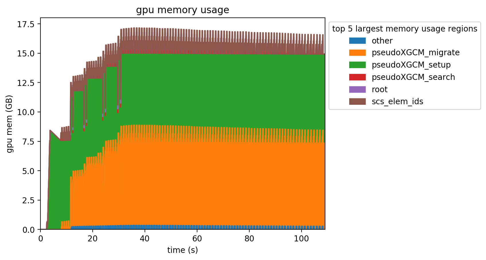

# parseKokkosMemEvents

The following code parses output from [kokkos-tools MemoryEvents](https://github.com/kokkos/kokkos-tools/wiki/MemoryEvents) to create an area plot (example below) that is grouped by the highest consuming 'regions' (defined by the Kokkos Profiling APIs `pushRegion(...)` and `popRegion(...)`).

Portions of the code are specific to the [pumipic](https://github.com/SCOREC/pumi-pic), its dependencies, and the profiling regions it defines.

## dependencies

python3 with `pyparsing`, `pandas`, and `matplotlib`

## run

`python ./memEventParse.py /path/to/h##n##-####.mem_events #MemoryRegionsToReport /path/to/plot.png` 
